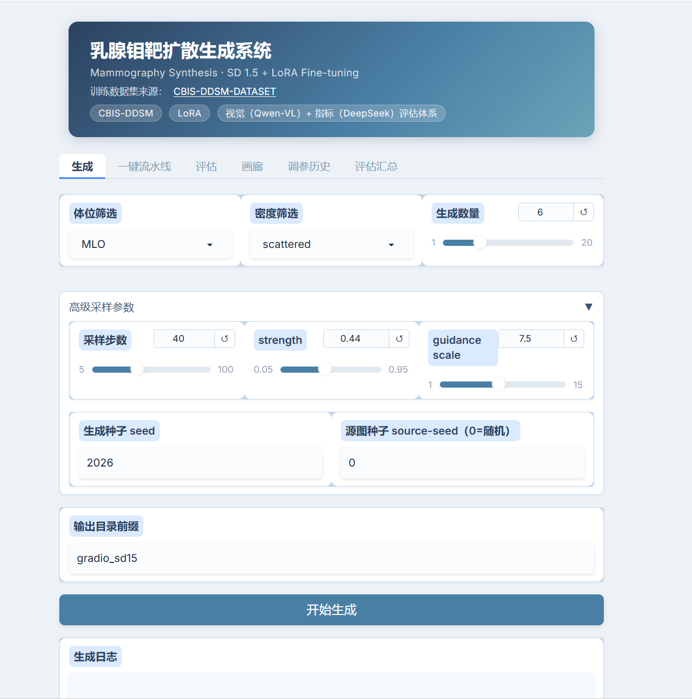
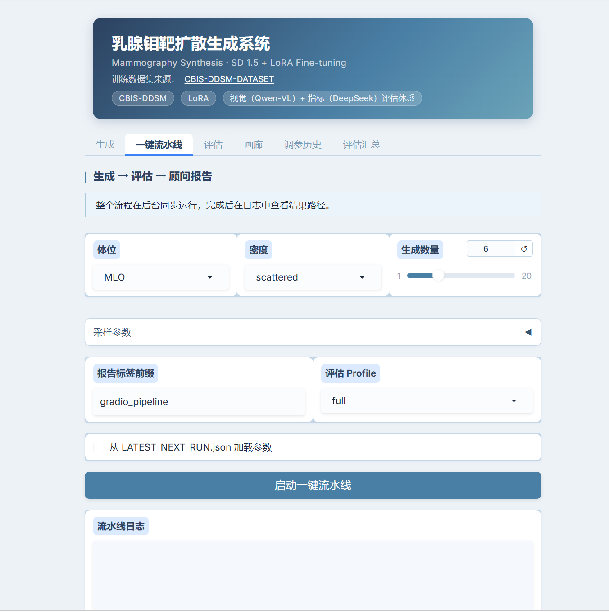
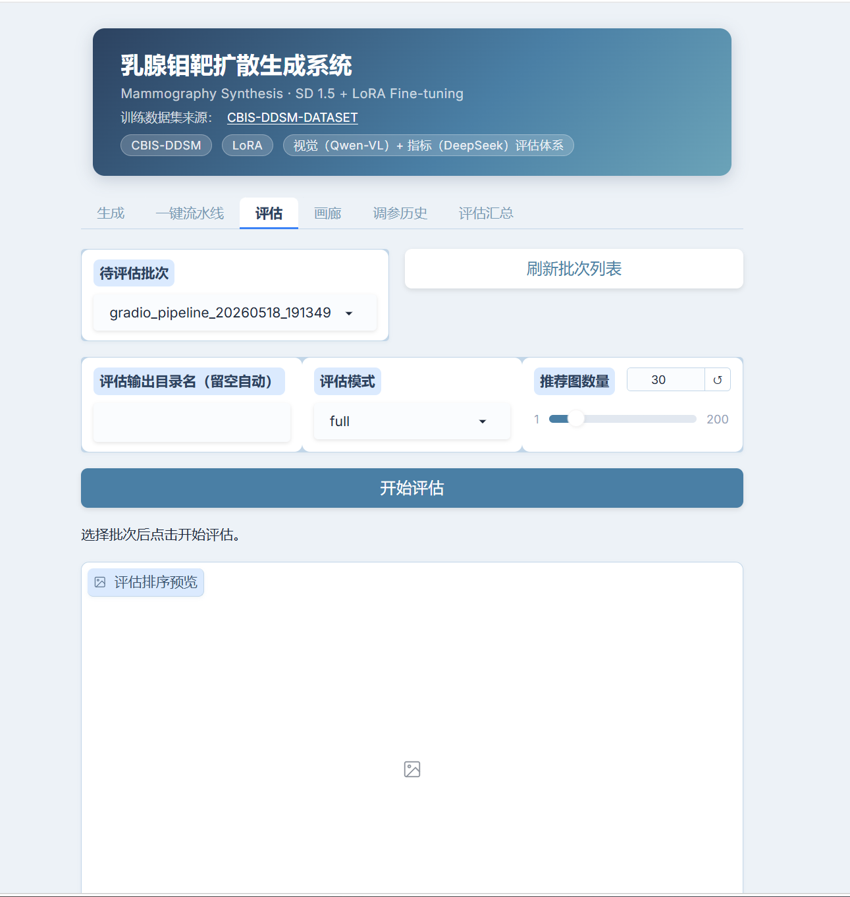
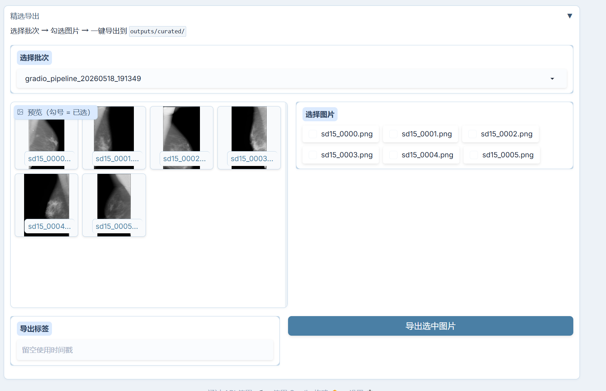
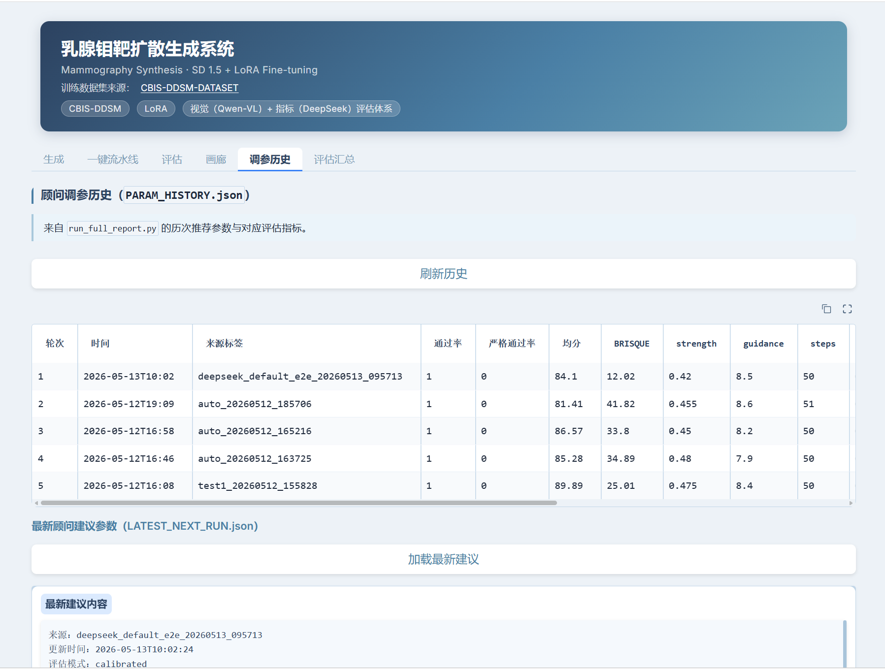

# MammoGen

[](LICENSE)
[](requirements.txt)
[](https://github.com/TraitYoung/medi-diff)
[](https://github.com/TraitYoung/medi-diff/actions/workflows/ci.yml)
[](https://huggingface.co/TraitYoung)

**English** · [简体中文](README.zh-CN.md)

**Synthetic mammography generation with automated quality control.**

**MammoGen** is an open toolchain for full-field digital mammography (FFDM) synthesis:
CBIS-DDSM cleaning → SD1.5 + LoRA training → full-image img2img → 16-dim rule-based QC → optional LLM reports.

> **Not for clinical diagnosis.** Research / education / synthetic-data tooling only.

Repo slug: [`medi-diff`](https://github.com/TraitYoung/medi-diff) · Product name: **MammoGen**

---

## Why this project

Most open mammography / medical diffusion repos stop at “train a LoRA and dump images”. MammoGen ships a **closed loop**:

| Pillar | What you get |
|--------|----------------|
| **Data** | CBIS-DDSM cleaning, breast masks, burn-in label scrubbing |
| **Generation** | SD1.5 + LoRA, default **full-image** img2img (no patch seams), reproducible `--source-seed` |
| **Evaluation** | 16-dim rule scores + hard/soft gates, plus optional FID/sFID — no GPT-4V required for QC |

Honest baseline: strict `pass_rate` is often around **~50%**. Failure modes (banding, shape oddities) are documented, not hidden.

---

## Architecture


| Stage | Entry |
|-------|--------|
| Preprocess | `scripts/preprocessing/` (`clean_cbis` → masks → `CBIS_CLEAN_V2`) |
| Train | `scripts/training/train_mammo_lora.py` |
| Generate | `scripts/generation/run_mammo_sd15.py` |
| Evaluate | `scripts/evaluation/review_generated_images.py` |
| Report | `scripts/assistant/run_generate_eval_advise.py` |
| UI / API | `bash apps/start.sh` → Gradio `:7860` + FastAPI `:8000` |

---

## Demo

Inference needs a local **NVIDIA GPU (≥8GB)**. UI screenshots live under [`docs/assets/`](docs/assets/); static HF Space packaging is under [`hf/mammo-gallery/`](hf/mammo-gallery/) (publish with `scripts/tools/publish_hf_assets.py`).

| Screenshot | Tab |
|------------|-----|
|  | Generate |
|  | Gallery |
|  | Real vs generated |
|  | One-click pipeline |
|  | Evaluation |

| HF asset | ID | Status |
|----------|-----|--------|
| LoRA card + weights | [`TraitYoung/mammo-sd15-lora-v6`](https://huggingface.co/TraitYoung/mammo-sd15-lora-v6) | Card in repo; upload when local LoRA + `HF_TOKEN` ready |
| Metadata | [`TraitYoung/cbis-clean-v2`](https://huggingface.co/datasets/TraitYoung/cbis-clean-v2) | Card in repo; CSV upload when local metadata ready |
| Gallery Space | [`TraitYoung/mammo-gallery`](https://huggingface.co/spaces/TraitYoung/mammo-gallery) | Static Gradio pack ready (`hf/mammo-gallery`) |

See [`hf/README.md`](hf/README.md).

---

## Quick start

### 1. Install

```bash
git clone https://github.com/TraitYoung/medi-diff.git
cd medi-diff

# Dev / CI (CPU): editable install + pytest/ruff
pip install -r requirements-dev.txt

# Full GPU runtime
pip install -r requirements.txt
# or: pip install -e ".[full]"

cp .env.example .env   # optional: text / Qwen-VL API keys for advisor reports
```

### Local GPU (RTX 50-series / Blackwell)

RTX 5070 Ti and other **sm_120** GPUs need **PyTorch built with CUDA 12.8+**. Older cu124 wheels often fail with `no kernel image is available for execution on the device`. Prefer **WSL2** over native Windows for fewer packaging pitfalls.

```bash
pip install torch torchvision --index-url https://download.pytorch.org/whl/cu128
python3 scripts/tools/check_local_gpu.py
# Expect mem-profile(auto) → local on ~12–16 GiB cards, and matmul probe: OK
```

Generation uses `--mem-profile auto` by default (`cloud` ≥20 GiB, `local` 10–20 GiB with attention/VAE slicing, `tight` <10 GiB with CPU offload). Gradio defaults to the **Local speed** preset (28 steps + `local`; UI label may show Chinese `本地流畅`).

### 2. Place weights & data

| Asset | Local path | HF (after publish) |
|-------|------------|--------------------|
| SD1.5 snapshot | `hf_cache/sd15/` | base model hub id / local snapshot |
| LoRA (r=32, all MLO) | `outputs/lora/mammo_sd15_v6_allMLO/final_lora/` | `TraitYoung/mammo-sd15-lora-v6` |
| Clean metadata | `datasets/CBIS_CLEAN_V2/metadata_clean.csv` | `TraitYoung/cbis-clean-v2` |
| Source JPEGs | paths in the CSV (often `datasets/jpeg/`) | obtain under CBIS-DDSM / TCIA terms |

```bash
# After you publish (needs HF_TOKEN + local assets):
python3 scripts/tools/publish_hf_assets.py --all
huggingface-cli download TraitYoung/mammo-sd15-lora-v6 \
  --local-dir outputs/lora/mammo_sd15_v6_allMLO/final_lora
```

### 3. Run

```bash
# UI + API
bash apps/start.sh

# Or one-shot CLI: generate → evaluate → advise
python3 scripts/assistant/run_generate_eval_advise.py \
  --metadata-csv datasets/CBIS_CLEAN_V2/metadata_clean.csv \
  --filter-view MLO --filter-density dense \
  --num-images 6 --tag-prefix my_run
```

Default sample output root: `outputs/generated/samples/`.  
Smoke check (no GPU): `python3 scripts/tools/verify_ui_wiring.py`  
GPU / VRAM profile: `python3 scripts/tools/check_local_gpu.py`

---

## Defaults (generation)

| Item | Value |
|------|--------|
| Mode | `full-image` (single-pass img2img) |
| Strength / CFG / steps | `0.44` / `7.5` / `40` (DPM-Solver++) |
| Mem profile | `auto` (`--mem-profile local` on typical 12–16 GiB GPUs) |
| LoRA | `mammo_sd15_v6_allMLO` (r=32) |
| Label guard | on by default (heuristic burn-in cleanup) |
| Source pre-filter | circularity ≥ 0.30, convex_defect ≤ 0.45 |

More parameters: see [`apps/README.md`](apps/README.md) and CLI `--help` on `run_mammo_sd15.py`.

---

## Evaluation (dual track)

1. **In-domain rules** — groups A–F (16 dims), `hard_tags` / `soft_reasons`, BRISQUE, spectrum β → `ok` / `total_score` for filtering.  
2. **Generic metrics** — FID/KID, Precision–Recall, sFID when `--real-images-dir` is set → `summary.json → academic_metrics`.

English overview: [`docs/en/evaluation.md`](docs/en/evaluation.md).  
Chinese detail: [`docs/评价体系说明.md`](docs/评价体系说明.md) · formulas: [`docs/评估标准说明.md`](docs/评估标准说明.md).

Tip: under `eval_profile=full`, tags like `GRID_SEAM` / `SKIN_LINE_MISSING` are often **soft** penalties. Prefer density-matched real baselines; do not treat auto-calibrated `pass_rate=1.0` as ground truth.

---

## Repository layout

| Path | Role |
|------|------|
| `apps/` | Gradio + FastAPI + start/stop |
| `scripts/core/` | Shared libs (`GenParams`, label guard, image utils, mem profiles) |
| `scripts/preprocessing/` | CBIS cleaning & masks |
| `scripts/training/` | LoRA training |
| `scripts/generation/` | Mainline `run_mammo_sd15.py` |
| `scripts/evaluation/` | Rule eval + compare runs |
| `scripts/assistant/` | Full pipeline + LLM advisor |
| `docs/` | Guides & design notes (`docs/en/` for English) |
| `archive/` | Retired experiments (not on mainline) |
| `datasets/`, `outputs/`, `hf_cache/` | Local data/weights (gitignored) |

---

## Docs

| Doc | Topic |
|-----|--------|
| [English docs index](docs/en/README.md) | User guide, API, evaluation, layout |
| [Chinese docs index](docs/README.md) | Full ZH guides + design notes |
| [apps README](apps/README.md) | Gradio vs API, presets, output dirs |
| [SECURITY](SECURITY.md) | Vulnerability reporting |

---

## License & data attribution

- **Code**: [MIT](LICENSE) © 2026 TraitYoung  
- **Training data**: derived from [CBIS-DDSM](https://www.cancerimagingarchive.net/collection/cbis-ddsm/) via TCIA / community mirrors such as [`sposso/CBIS-DDSM-DATASET`](https://github.com/sposso/CBIS-DDSM-DATASET).  
  Redistribute cleaned subsets only under the **original TCIA / CBIS-DDSM terms** (commonly CC BY–style with attribution). This repo does **not** relicense the images.  
- **Base model**: Stable Diffusion 1.5 — follow its original license when redistributing weights.

---

## Citation

```bibtex
@software{mammogen2026,
  title   = {MammoGen: Mammography Diffusion Generation with Automated QC},
  author  = {TraitYoung},
  year    = {2026},
  url     = {https://github.com/TraitYoung/medi-diff},
  note    = {Open-source toolchain; not for clinical use}
}
```

Also see [`CITATION.cff`](CITATION.cff).

---

## FAQ

**Q: Do I need an LLM API key?**  
A: No for generate/eval. Keys in `.env` are only for optional advisor reports (`run_generate_eval_advise` / `run_full_report`).

**Q: Gallery is empty after an upgrade — where are batches written?**  
A: Default root is `outputs/generated/samples/`. Move any older batch folders into that directory.

**Q: Can I use patch-overlap generation?**  
A: Full-image is the supported default. Historical patch routes live under `archive/` / git history for research replay.

**Q: Will there be a browser demo without a GPU?**  
A: Planned HF Space gallery of pre-generated samples (`TraitYoung/mammo-gallery`), not live diffusion.

---

## Roadmap

See [`ROADMAP.md`](ROADMAP.md) · [`CHANGELOG.md`](CHANGELOG.md) · [`CONTRIBUTING.md`](CONTRIBUTING.md).
